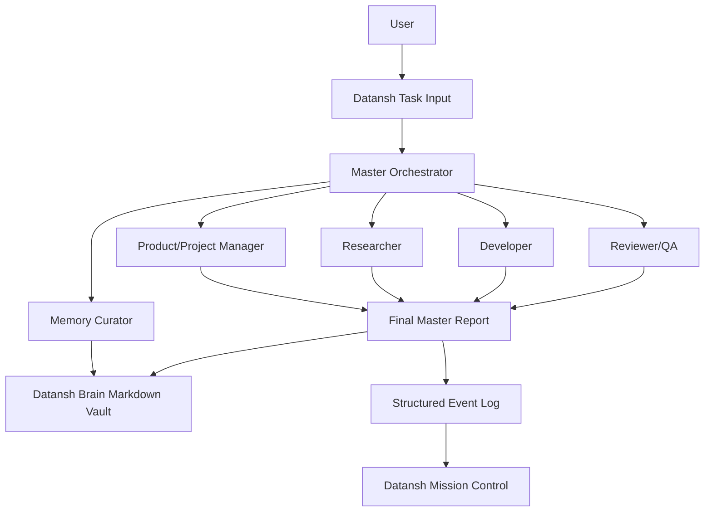

# Datansh Agent OS Architecture

Hermes Agent is kept as the local runtime base. The Datansh wrapper owns role prompts, task routing, structured events, demo artifacts, free-model guardrails, and markdown memory updates.

For the one-day POC, I recommend starting with a Hermes Agent fork because it already has the closest shape to what we want: persistent memory, skills, subagents/delegation, sessions, model-provider flexibility, and local/dashboard operation.

I am not treating Hermes as the final answer yet. I am using it as the fastest way to validate the Datansh Agent OS concept. After the demo works, we should compare whether to keep extending Hermes or build a thinner Datansh-owned orchestration layer using LangGraph or Agno.

