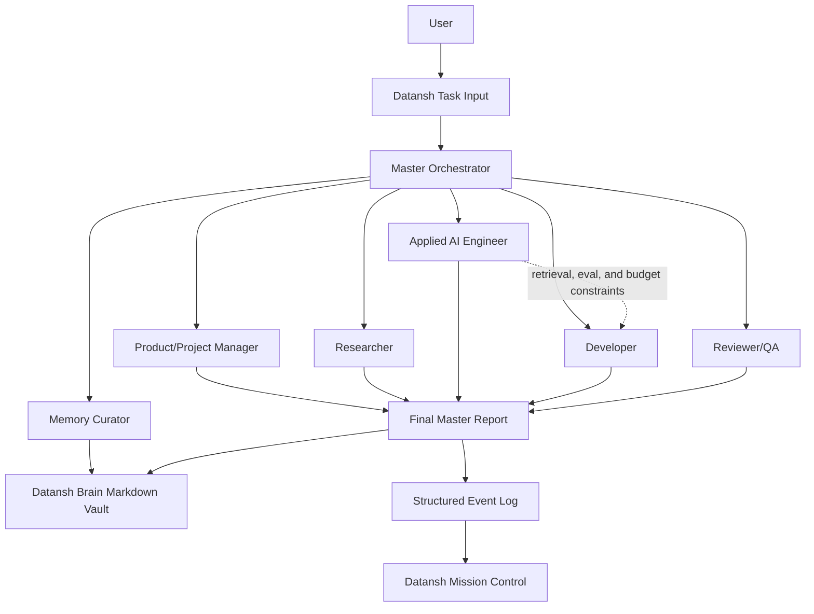

# Datansh Agent OS Architecture

Roles run in sequence, each seeing the previous outputs. The Applied AI Engineer runs before the Developer on purpose: retrieval design, evaluation strategy, and cost budgets constrain the schema and the API contract, so deciding them after implementation planning means reworking it.

## Datansh Stack Alignment

The role prompts and brain files encode the Datansh stack — Java 21 with Spring Boot 3 on the backend, React and Next.js App Router on the frontend, and applied AI shipped as production services rather than notebooks. Agents start from those defaults and are instructed to defer to whatever a real repository actually does. Stack specifics live in `datansh-brain/00-company-context.md` and `datansh-brain/03-coding-standards.md`, so changing the house standard is a single-file edit rather than a rewrite of six prompts.

Hermes Agent is kept as the local runtime base. The Datansh wrapper owns role prompts, task routing, structured events, demo artifacts, free-model guardrails, and markdown memory updates.

For the one-day POC, I recommend starting with a Hermes Agent fork because it already has the closest shape to what we want: persistent memory, skills, subagents/delegation, sessions, model-provider flexibility, and local/dashboard operation.

I am not treating Hermes as the final answer yet. I am using it as the fastest way to validate the Datansh Agent OS concept. After the demo works, we should compare whether to keep extending Hermes or build a thinner Datansh-owned orchestration layer using LangGraph or Agno.

